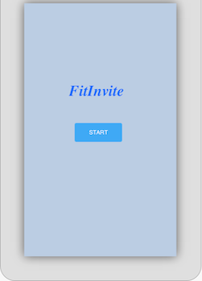
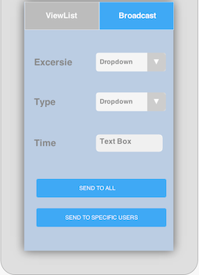

Working out alone is not fun at all!  So we are building this app to help you to find your gym buddy! Workout together and stay fit and yes using our app you can make new friends too!

Use cases are as follows:
1.	Create profile by providing information such as username, password profile image, and age.
Search your gym using Google API and subscribe to it.

2.	View the list of people who are going to do exercise in your gym for a particular day.
3.	Create your own exercise event and send it to all user subscribed to your gym or select specific users and broadcast.

Initial phase:
1.	We are allowing particular user to subscribe to single gym.

Addition features:        
1.	Multiple gyms subscription.
2.	Connecting user profile with social networking sites.
3.	Gym promotions.

Advance version:
Making generic application, which will work in multiple domains with publish-subscribe model. For example: communities. sports etc.

[User Stories]
 
1) Login with twitter
2) Insert values for user profile
3) Get list of available communities
3) Subscribe to a Gym (Community)
4) Get events from the subscribed Gym
5) Publish events to subscribed Gyms
6) (Tentative) Join another user's event 

[Wire frames: Screen views]

