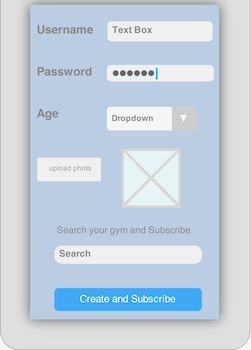
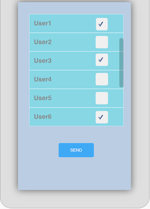
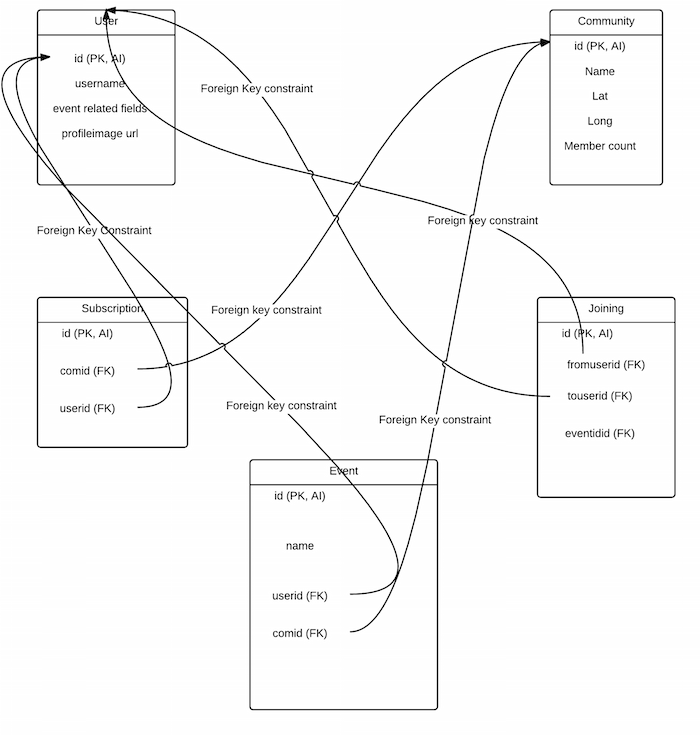

[User Stories]
 
1) Login with twitter
2) Insert values for user profile
3) Get list of available communities
3) Subscribe to a Gym (Community)
4) Get events from the subscribed Gym
5) Publish events to subscribed Gyms
6) (Tentative) Join another user's event 

[Wire frames: Screen views]

